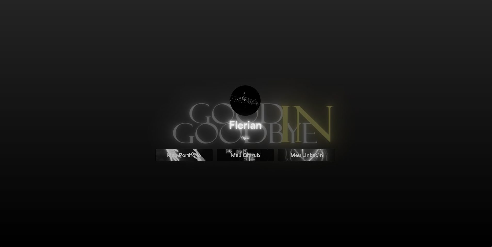
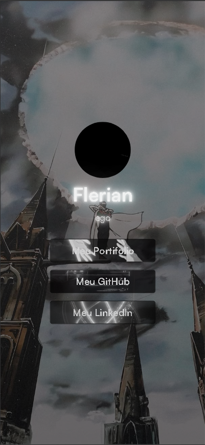
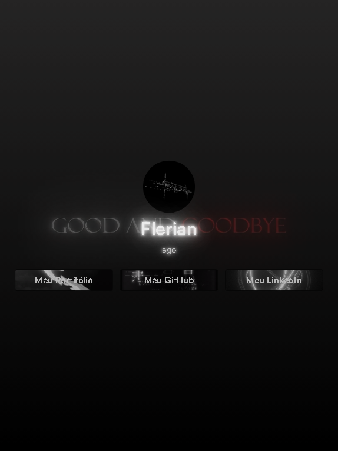

## Sobre este projeto

Este repositório foi criado como parte de um exercício criativo e técnico, usando o nome fictício "Flerian" — uma identidade que utilizo em jogos e projetos pessoais. A ideia foi construir um portfólio interativo que reunisse meus principais links, projetos e experiências, tudo com um toque de personalidade. Além de servir como vitrine das minhas habilidades em front-end, este site também representa minha forma de explorar o lado lúdico da programação e da construção de interfaces.

---

## 🌐 Acesse o projeto

🔗 [Clique aqui para visitar o site](https://gustavo-profile.netlify.app/)

---

## ✨ Tecnologias utilizadas

- 🧱 HTML5
- 🎨 CSS3
- 🚀 Hospedagem via Netlify

---

## 📸 Preview do projeto

>Desktop / Phone / Tablet

---

